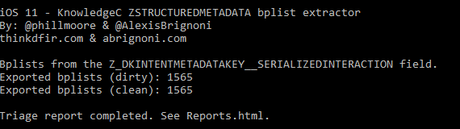

# iOS-KnowledgeC-StructuredMetadata-Bplists
Scripts to extract compound bplists in the iOS -> KnowledgeC.db -> structuredmetadata table.

  

Usage: 
1. Python 3
2. The ccl_bplist module is required for the scripts to work. It can be found here: https://github.com/cclgroupltd/ccl-bplist
3. Export a knowledgeC databse from iOS and place it in the same root directory as the script.
4. Run the script. A timestamp named folder will be created that will contain two folders. One for extracted database content (named dirty) and one for the extracted bplist contained within the extracte database content (clean.)
5. Timestamped folder will aslo contain a HTML report with information on the clean bplists.
